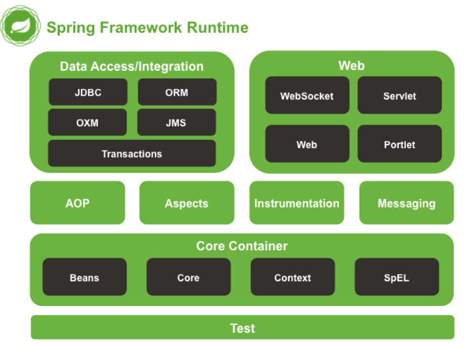


**<p style="color:red;">Current Versions</p>**

The current stable version, as of September 2023, is Spring 6.0.11

The current stable version, as of September 2023, is Spring Boot 3.1.3.

Spring Boot 3.1.3 requires Java 17 as a minimum version. If you are currently using Java 8 or 11, you’ll need to stick to the 2.x release train.

**<p style="color:red;">Evolution of Spring</p>**

Java developers needed to use **JavaBeans** to create Web applications. Although JavaBeans helped in the development of user interface (UI) components, they were not able to provide services, such as transaction management and security, which were required for developing robust and secure enterprise applications. 

The advent of **Enterprise Java Beans (EJB)** was seen as a solution to this problem. EJB extends the Java components, such as Web and enterprise components, and provides services that help in enterprise application development. However, developing an enterprise application with EJB was not easy, as the developer needed to perform various tasks, such as creating Home and Remote interfaces and implementing lifecycle callback methods which lead to the complexity of providing code for EJBs.

The **Spring framework** has emerged as a solution to all these complications This framework uses various new techniques such as Aspect-Oriented Programming (AOP), Plain Old Java Object (POJO), and dependency injection (DI), to develop enterprise applications, thereby removing the complexities involved while developing enterprise applications using EJB.

A key design principle in Spring Web MVC and in Spring in general is the “**Open for extension, closed for modification**” principle.

Some methods in the core classes of Spring Web MVC are marked final. As a developer you cannot override these methods to supply your own behavior. This has not been done arbitrarily, but specifically with this principle in mind.

**<p style="color:red;">Spring Framework Architecture</p>**



1. **Spring Core Module** 

The **Core** Container consists of the spring-core, spring-beans, spring-context, spring- context-support, and spring-expression (Spring Expression Language) modules.

The spring-core and spring-beans modules provide the fundamental parts of the framework, including the IoC and Dependency Injection features. The BeanFactory is a sophisticated implementation of the factory pattern. It removes the need for programmatic singletons and allows you to decouple the configuration and specification of dependencies from your actual program logic.

The ***Context*** (spring-context) module builds on the solid base provided by the *Core and Beans* modules: it is a means to access objects in a framework-style manner that is similar to a JNDI registry. The Context module inherits its features from the Beans module and adds support for internationalization (using, for example, resource bundles), event propagation, resource loading, and the transparent creation of contexts by, for example, a Servlet container. The Context module also supports Java EE features such as EJB, JMX, and basic remoting. The ApplicationContext interface is the focal point of the Context module. 

2. **AOP and Instrumentation**

The spring-aop module provides an aspect-oriented programming implementation allowing you to define, for example, method interceptors and pointcuts to cleanly decouple code that implements functionality that should be separated. In Spring AOP, the aspects are the regular Spring beans or regular classes annotated with @Aspect annotation.

The spring-instrument module provides class instrumentation support and classloader implementations to be used in certain application servers. The spring-instrument-tomcat module contains Spring’s instrumentation agent for Tomcat.

3. **Messaging**

Spring Framework 4 includes a spring-messaging module with key abstractions from the Spring Integration project such as Message, MessageChannel, MessageHandler, and others to serve as a foundation for messaging-based applications. The module also includes a set of annotations for mapping messages to methods, similar to the Spring MVC annotation-based programming model.

4. **Data Access/Integration**

The Data Access/Integration layer consists of the JDBC, ORM, OXM, JMS, and Transaction modules(spring-tx).

The Spring ORM module is used for accessing data from databases in an application. It provides APIs for manipulating databases with JDO, Hibernate, and iBatis.

Helps in handling **transaction management** of an application without affecting its code. This framework provides Java Transaction API (**JTA**) for global transactions managed by an application server and local transactions managed by using the **JDBC** **Hibernate**, Java Persistence API (**JPA**), Java Data Objects (**JDO**), or other data access APIs. It enables the developer to model a wide range of transactions based on Spring’s declarative and programmatic transaction management.

5. **Web**

The Web layer consists of the spring-web, spring-webmvc, spring-websocket, and spring- webmvc-portlet modules.

**Spring MVC** framework allows you to build Web applications based on MVC architecture. All the requests made by a user first go through the controller and are then dispatched to different views, that is, to different JSP pages or Servlets.

The Spring Web **model-view-controller (MVC)** framework is designed around a DispatcherServlet that dispatches requests to handlers, with configurable handler mappings, view resolution, locale and theme resolution as well as support for uploading files. The default handler is based on the @Controller and @RequestMapping annotations, offering a wide range of flexible handling methods. With the introduction of Spring 3.0, the @Controller mechanism also allows you to create RESTful Web sites and applications, through the @PathVariable annotation and other features.

In **Spring MVC**, when a request is generated from the browser, it first goes to the DispatcherServlet class (Front Controller), which dispatches the request to a controller (SimpleFormController class or AbstractWizardformController class) using a set of handler mappings. The controller extracts and processes the information embedded in a request and sends the result to the DispatcherServlet class in the form of the model object. Finally, the DispatcherServlet class uses ViewResolver classes to send the results to a view, which displays these results to the users.

The **Spring Web Flow** helps in defining XML file or Java Class that manages the workflow between different pages of a Web application. The following are the advantages of Spring Web Flow:

- The flow between different UIs of the application is clearly provided by defining Web flow in XML file.
- Web flow definitions help you to virtually split an application in different modules and reuse these modules in multiple situations.

6. **Test**

The spring-test module supports the unit testing and integration testing of Spring components with JUnit or TestNG. It provides consistent loading of Spring ApplicationContexts and caching of those contexts. It also provides mock objects that you can use to test your code in isolation.

1. **<p style="color:red;">Why will you choose Spring Boot over Spring Framework?</p>**

Spring is widely used for creating scalable applications. For web applications Spring provides Spring MVC which is a widely used module of spring which is used to create scalable web applications. But main disadvantage of spring projects is that configuration is time-consuming and can be a bit overwhelming for the new developers.

Solution to this is Spring Boot which is a microservice-based framework.

- **Dependency Resolution / Avoid version conflict.**
  - It allows specifying all required dependencies according to the respective Spring-Boot version in one place itself.
  - You can specify or change the Spring-Boot version. On changing Spring-Boot versions, all the versions of mentioned(added) dependencies will be updated automatically.
  - We must add the dependencies in the pom.xml/build.gradle file.
  - These added dependencies will then get downloaded from Maven Central.
  - The downloaded dependencies will get stored into the ‘.m2’ folder in the local file system.
- **Avoid additional configuration.**
- **Embed Tomcat, Jetty (no need to deploy WAR files)**
- **Provide production-ready features such as metrics, health checks.**
- **Provides easy maintenance and creation of REST endpoints**
- **It allows avoiding heavy configuration of XML which is present in spring**

2. **<p style="color:red;">What are Spring-Boot Starters?</p>**

They are a set of convenient dependency descriptors that one should mention in your application. You can get access to all Spring and related tech stacks that you require for the project. A starter has a similar naming pattern – ( spring-boot-starter-\* ). Third-party starters do not start with ‘spring-boot’.

Example: `spring-boot-starter-jdbc`

Types of Starters:

1. Application Starters.
2. Technical Starters.
3. Production-ready Starters.

All the required dependencies of Spring-Boot are embedded in the ‘dependencies’ tag/block.

**Maven -> pom.xml**

```
<dependencies>
    <dependency>
      <groupId> ... </groupId>
      <artifactId> ... </artifactId>
      <version> ... </version>
    </dependency>
</dependencies>
```
**A – Starter Parent**

To take advantage of auto-configured ‘sensible’ defaults, you should add Starter Parent in the project your build.
```
<parent>
  <groupId>org.springframework.boot</groupId>
  <artifactId>spring-boot-starter-parent</artifactId>
  <version>\_\_\_</version>
</parent>
```
With default configuration like above, you can override respective dependencies by overriding a ‘property’.
```
<properties>
  <slf4j.version>\_\_\_</slf4j.version>
</properties>
```
This will make sure that the mentioned version of a SLF4j library will be used.

**B – Java Version**

You can also change the java version in the following –
```
<properties>
  <java.version>\_\_\_</java.version>
</properties>
```

**C – Developer Tools**

A set of specific tools to make the application development process much easier. It is in the `spring-boot-devtools` module.
Maven -> pom.xml
```
<dependency>
  <groupId>org.springframework.boot</groupId>
  <artifactId>spring-boot-devtools</artifactId>
  <optional>true</optional>
</dependency>
```

**Gradle** 

In the case of a ‘Starter Parent’ like in Maven, here there is no ‘Super Parent’ to take advantage of some auto configurations. To add dependencies in Gradle, add them in the `dependencies{ }` section. For providing executable jar, you can add the following in the dependencies section – `spring-boot-gradle-plugin`

Example – build.gradle
```
buildscript {
  repositories {
    jcenter()
  }
  dependencies {
    classpath("org.springframework.boot:spring-boot-gradle-plugin:1.3.8.RELEASE")
  }
}
apply plugin: 'java'
apply plugin: 'spring-boot'
repositories {
  jcenter()
}
dependencies {
  compile("org.springframework.boot:spring-boot-starter-web")
  testCompile("org.springframework.boot:spring-boot-starter-test")
}
```

For adding the ‘Developer tools‘, add the following in the `dependencies` block
```
Gradle -> build.gradle
developmentOnly("org.springframework.boot:spring-boot-devtools")
```

**Note: Each release of Spring Boot is associated with a base version of the Spring Framework, so it is highly recommended to not specify its version on your own.**

3. **<p style="color:red;">What is IoC container?</p>**

Inversion of Control (IoC) principle or IoC is also known as **dependency injection (DI)**.

It is a process whereby objects define their dependencies, that is, the other objects they work with, only through constructor arguments, arguments to a factory method, or properties that are set on the object instance after it is constructed or returned from a factory method. 

The container then injects those dependencies when it creates the **bean**. This process is fundamentally the **inverse**, hence the name Inversion of Control (IoC), of the bean itself controlling the instantiation or location of its dependencies by using direct construction of classes, or a mechanism such as the **Service Locator** pattern.

In Spring, the objects that form the backbone of your application and that are managed by the Spring IoC container are called **beans**. A **bean** is an object that is instantiated, assembled, and otherwise managed by a Spring IoC container. Otherwise, a bean is simply one of many objects in your application. Beans, and the dependencies among them, are reflected in the configuration metadata used by a container.

4. **<p style="color:red;">Describe the @SpringBootApplication Annotation</p>**

Many Spring Boot developers like their apps to use auto-configuration, component scan and be able to define extra configuration on their "application class". A single `@SpringBootApplication` annotation can be used to enable those three features, that is:

- `@EnableAutoConfiguration`: enable Spring Boot’s auto-configuration mechanism
- `@ComponentScan`: enable @Component scan on the package where the application is located.
- `@Configuration`: allow to register extra beans in the context or import additional configuration classes

Ex:
```
package com.example.myapplication;

import org.springframework.boot.SpringApplication;
import org.springframework.boot.autoconfigure.SpringBootApplication;

@SpringBootApplication // same as @Configuration @EnableAutoConfiguration @ComponentScan
public class Application {

	public static void main(String[] args) {
		SpringApplication.run(Application.class, args);
	}

}
```
None of these features are mandatory and you may choose to replace this single annotation by any of the features that it enables. For instance, you may not want to use component scan in your application:

```
package com.example.myapplication;

import org.springframework.boot.SpringApplication;
import org.springframework.context.annotation.ComponentScan
import org.springframework.context.annotation.Configuration;
import org.springframework.context.annotation.Import;

@Configuration
@EnableAutoConfiguration
@Import({ MyConfig.class, MyAnotherConfig.class })
public class Application {

	public static void main(String[] args) {
			SpringApplication.run(Application.class, args);
	}

}
```


**Note** that @Component will only load the classes in the Main class and sub-directory within the main-class directory or root package/directory. If you want another package to be loaded then specify `@SpringBootApplication(scanBasePackages = “com.external.package”`)

The primary annotations that Spring Boot offers reside in its `org.springframework.boot.autoconfigure` and its sub-packages.

To **exclude** the auto configuration of packages:

`@SpringBootApplication(exclude = {DataSourceAutoConfiguration.class})`

To exclude classes.
You can also exclude my using application.properties (or application.yml) file.  
`Spring.autoconfigure.excelude=<give the fully qualified package name>`

Or if you are not using the `@SpringBootApplication` then you can do with `@EnableAutoConfiguration(exclude = {DataSourceAutoConfiguration.class}))`

**`@AutoConfiguration`**

`@ConditionalOnClass(ObjectMapper.class)`

This will load all classes based on the conditions specified. In the above if the Object is used then load the specified packages.
`@ConditionalOnClass(DataSource.class, EmbeddedDatabaseType.class )`  

Only if all conditions are met auto configure will work.  
Some conditions will be met because those will be the default setting on spring boot.  
To instruct an auto-configuration class to back off when a bean already exists, we can use the `@ConditionalOnMissingBean` annotation.

5. **<p style="color:red;">How to Register a Custom Auto-Configuration?</p>**

To register an auto-configuration class, we must have its fully qualified name listed under the EnableAutoConfiguration key in the META-INF/spring.factories file:

`org.springframework.boot.autoconfigure.EnableAutoConfiguration=com.baeldung.autoconfigure.CustomAutoConfiguration`

If we build a project with Maven, that file should be placed in the resources/META-INF directory, which will end up in the mentioned location during the package phase.

6. **<p style="color:red;">What all spring boot started you have used or what all module you have worked on?</p>**

Each starter plays a role as a one-stop shop for all the Spring technologies we need. Other required dependencies are then transitively pulled in and managed in a consistent way.

All starters are under the org.springframework.boot group and their names start with spring-boot-starter-

- Spring boot starter web - `spring-boot-starter-web`
```
<dependency> 
  <groupId>org.springframework.boot</groupId> 
  <artifactId*spring-boot-starter-web</artifactId> 
</dependency>
```
- Spring boot starter data JPA - `spring-boot-starter-data-jpa`
- Spring boot starter AOP
- Spring boot starter Test - `spring-boot-starter-test`
- Spring boot starter web services
- Spring boot starter security
- Spring boot starter for Apache Kafka
- Spring boot starter Spring Cloud

7. **<p style="color:red;">How will you run your Spring Boot Application?<p>** 

You can run it directly inside the IDE of choice or use the Maven Plugin.

Goes to Target folder and inside Classes goes to the main class or application to trigger the run. The Maven will create a jar file dynamically when running the project. Inside the Manifest file there will be all the details required for running the jar file or the project.

The Spring Boot Maven Plugin provides Spring Boot support in Maven, letting you package executable jar or war archives and run an application “in-place”. To use it, you must use Maven 3.2 (or later).

`mvn spring-boot:run`

To use the Spring Boot Maven Plugin, include the appropriate XML in the plugins section of your pom.xml, as shown in the following example:

```
<?xml version="1.0" encoding="UTF-8"?>
<project xmlns="http://maven.apache.org/POM/4.0.0" xmlns:xsi="http://www.w3.org/2001/XMLSchema-instance"
	xsi:schemaLocation="http://maven.apache.org/POM/4.0.0 https://maven.apache.org/xsd/maven-4.0.0.xsd">
	<modelVersion>4.0.0</modelVersion>
	<!-- ... -->
	<build>
		<plugins>
			<plugin>
				<groupId>org.springframework.boot</groupId>
				<artifactId>spring-boot-maven-plugin</artifactId>
				<version>2.1.5.RELEASE</version>
				<executions>
					<execution>
						<goals>
							<goal>repackage</goal>
						</goals>
					</execution>
				</executions>
			</plugin>
		</plugins>
	</build>
</project>
```

The preceding configuration repackages a jar or war that is built during the package phase of the Maven lifecycle. The following example shows both the repackaged jar as well as the original jar in the target directory:
```
$ mvn package
$ ls target/\*.jar
target/myproject-1.0.0.jar target/myproject-1.0.0.jar.original
```

If you do not include the <execution/> configuration, as shown in the prior example, you can run the plugin on its own (but only if the package goal is used as well), as shown in the following example:
```
$ mvn package spring-boot:repackage
$ ls target/\*.jar
target/myproject-1.0.0.jar target/myproject-1.0.0.jar.original
```

8. **<p style="color:red;">How Spring boot run() method works internally?</p>**

The entry point of the Spring Boot Application is the class which contains `@SpringBootApplication` annotation along with the main method. The main method should contain `SpringApplication.run()` method.

`SpringApplication.run(MyFirstApplication.class, args);`

The run() method takes these two arguments, first one is the class MyFirstApplication.class and the other is the command line argument(i.e. args) that we have passed to the main() method.

So, the run() method performs the below tasks :

- Sets up the initial configuration.
The run() method sets up the initial configuration those are needed for Spring Boot to start. So that you don't have to configure them all by yourself.  
It prepares the environment internally, using the application.properties and application.yml file.

- Starts the Application Context of Spring.
You can consider the Application Context as the main container for Spring. In Spring when you define classes, those classes(Also called as beans) are managed by the Application Context. And the run() method creates this Application Context.  
The run method returns a `ConfigurableApplicationContext`  
`ConfigurableApplicationContext context = SpringApplication.run(MyFirstApplication.class, args);`  

- Scans Class Path or Register bean into context
Spring contains Controller classes that are marked with @Controller annotation and also there are Service classes annotated with @Service annotation.  
The run() method scans the Class Path and figures out which all classes are marked with @Controller annotation or @Service annotation or something else. Based on that Spring takes the decision that how they should behave.

- Downloads and starts Tomcat Server.
Since, this is a web application we are trying to build, we need a server to deploy and start the application. And in this case Tomcat Server is used.  
Spring Boot has downloaded and started the Tomcat server for us.  
And this entire thing is done by the magical run() method.

9. **<p style="color:red;">Why would you implement the CommandLineRunner.run() method and use instead of the SpringApplication.run()?<p>**

If for example you want to do any pre-processing logic at start-up like initiate a DB connection, populate some data to DB etc.  
If both the run() methods are available then the SpringApplication.run() will execute first.

10. **<p style="color:red;">How to enable debugging log in the spring boot application?<p>**

Debugging logs can be enabled in three ways –

- We can start the application with `--debug` switch.
- We can set the `logging.level.root=debug` property in application.property file.
- We can set the logging level of the root logger to debug in the supplied logging configuration file.
- In the Application.properties set `debug = true`

11. **<p style="color:red;">What is Aspect-Oriented Programming (AOP)?</p>**

Aspect-Oriented Programming (AOP) complements Object-Oriented Programming (OOP) by providing another way of thinking about program structure. The key unit of modularity in OOP is the **class**, whereas in AOP the unit of modularity is the **aspect**. Aspects enable the modularization of **concerns** such as **transaction management** that cut across multiple types and objects. (Such **concerns** are often termed **crosscutting** concerns in AOP literature.)

**Aspect**: a modularization of a concern that cuts across multiple classes. Transaction management is a good example of a crosscutting concern in J2EE applications. In Spring AOP, aspects are implemented using regular classes (the schema-based approach) or regular classes annotated with the @Aspect annotation (the @AspectJ style).

**Join point**: a point during the execution of a program, such as the execution of a method or the handling of an exception. In Spring AOP, a join point always represents a method execution.

**Advice**: action taken by an aspect at a particular join point. Different types of advice include “around,” “before” and “after” advice. (Advice types are discussed below.) Many AOP frameworks, including Spring, model an advice as an interceptor, maintaining a chain of interceptors around the join point.

**Pointcut**: a predicate that matches join points. Advice is associated with a pointcut expression and runs at any join point matched by the pointcut (for example, the execution of a method with a certain name). The concept of join points as matched by pointcut expressions is central to AOP, and Spring uses the AspectJ pointcut expression language by default.

**Introduction**: declaring additional methods or fields on behalf of a type. Spring AOP allows you to introduce new interfaces (and a corresponding implementation) to any advised object. For example, you could use an introduction to make a bean implement an IsModified interface, to simplify caching. (An introduction is known as an inter-type declaration in the AspectJ community.)

**Target object:** object being advised by one or more aspects. Also referred to as the advised object. Since Spring AOP is implemented using runtime proxies, this object will always be a proxied object.

**AOP proxy**: an object created by the AOP framework in order to implement the aspect contracts (advise method executions and so on). In the Spring Framework, an AOP proxy will be a JDK dynamic proxy or a CGLIB proxy.

**Weaving:** linking aspects with other application types or objects to create an advised object. This can be done at compile time (using the AspectJ compiler, for example), load time, or at runtime. Spring AOP, like other pure Java AOP frameworks, performs weaving at runtime.

**Types of advice:**

- **Before advice**: Advice that executes before a join point, but which does not have the ability to prevent execution flow proceeding to the join point (unless it throws an exception).
- **After returning advice**: Advice to be executed after a join point completes normally: for example, if a method returns without throwing an exception.
- **After throwing advice**: Advice to be executed if a method exits by throwing an exception.
- **After (finally) advice**: Advice to be executed regardless of the means by which a join point exits (normal or exceptional return).
- **Around advice**: Advice that surrounds a join point such as a method invocation. This is the most powerful kind of advice. Around advice can perform custom behavior before and after the method invocation. It is also responsible for choosing whether to proceed to the join point or to shortcut the advised method execution by returning its own return value or throwing an exception.

12. **<p style="color:red;">What Is Spring Initializr?</p>**

Spring Initializr is a convenient way to create a Spring Boot project.

We can go to the Spring Initializr site, choose a dependency management tool (either Maven or Gradle), a language (Java, Kotlin or Groovy), a packaging scheme (Jar or War), version and dependencies, and download the project.

This creates a **skeleton** project for us and saves setup time so that we can concentrate on adding business logic.

13. **<p style="color:red;">What Does It Mean That Spring Boot Supports Relaxed Binding?</p>**

Relaxed binding in Spring Boot is applicable to the **type-safe binding** of configuration properties.

With relaxed binding, the key of a property doesn’t need to be an exact match of a property name. Such an environment property can be written in camelCase, kebab-case, snake\_case, or in uppercase with words separated by underscores.

For example, if a property in a bean class with the @ConfigurationProperties annotation is named myProp, it can be bound to any of these environment properties: myProp, my-prop, my\_prop, or MY\_PROP.

14. **<p style="color:red;">What is Spring Actuator? What are its advantages?</p>**

An actuator is an additional feature of Spring that helps you to **monitor** and **manage** your application when you push it to production. These actuators include auditing, health, CPU usage, HTTP hits, and metric gathering, and many more that are automatically applied to your application.

To **enable** the spring actuator feature, we need to add the dependency of “spring-boot-starter-actuator” in pom.xml.
```
<dependency>
  <groupId> org.springframework.boot</groupId>
  <artifactId> spring-boot-starter-actuator </artifactId>
</dependency>
```
Spring Boot Actuator can **expose** operational information using either **HTTP or JMX** endpoints. But most applications go for **HTTP**, where the identity of an endpoint and the ***/actuator*** prefix form a URL path.

Actuators provide below pre-defined **endpoints** to monitor our application -

- Health
- Info
- Beans
- Mappings
- Configprops
- Httptrace
- Heapdump
- Threaddump
- Shutdown

15. **<p style="color:red;">Can we create a non-web application in Spring Boot?</p>**

Yes, we can create a non-web application by removing the web dependencies from the classpath along with changing the way Spring Boot creates the application context.

16. **<p style="color:red;">Can we override or replace the Embedded tomcat server in Spring Boot?</p>**

Yes, we can replace the Embedded Tomcat server with any server by using the **Starter** **dependency** in the pom.xml file. Like you can use spring-boot-starter-jetty as a dependency for using a jetty server in your project.

Spring MVC supports Tomcat, Jetty and Undertow. 

17. **<p style="color:red;">Explain @RestController annotation in Spring boot?</p>**

It is a combination of @Controller and @ResponseBody, used for creating a restful controller. It converts the response to JSON or XML. It ensures that data returned by each method will be written straight into the response body instead of returning a template.

18. **<p style="color:red;">How to Change the Default Port in Spring Boot?</p>**

We can change the default port of a server embedded in Spring Boot using one of these ways:

- Using a properties file – We can define this in an application.properties (or application.yml) file using the property server.port.
- Programmatically – In our main @SpringBootApplication class, we can set the server.port on the SpringApplication instance.
- Using the command line – When running the application as a jar file, we can set the server.port as a java command argument:
  `java -jar -Dserver.port=8081 myspringproject.jar`

19. **<p style="color:red;">What Is Spring Boot DevTools Used For?</p>**

Spring Boot Developer Tools, or DevTools, is a set of tools making the development process easier.

To include these development-time features, we just need to add a dependency to the pom.xml file:
```
<dependency>
  <groupId>org.springframework.boot</groupId>
  <artifactId>spring-boot-devtools</artifactId>
</dependency>
```
The spring-boot-devtools module is automatically disabled if the application runs in production. The repackaging of archives also excludes this module by default. So, it won’t bring any overhead to our final product.

By default, DevTools applies properties suitable to a development environment. These properties **disable template caching, enable debug logging for the web group**, and so on. As a result, we have this sensible development-time configuration without setting any properties.

Applications using DevTools **restart whenever a file on the classpath changes**. This is a very helpful feature in development, as it gives quick feedback for modifications.

By default, static resources, including view templates, don’t set off a restart. Instead, a resource change triggers a browser refresh. Notice this can only happen if the **LiveReload** extension is installed in the browser to interact with the embedded LiveReload server that DevTools contains.

20. **<p style="color:red;">How to Write Integration Tests?</p>**

When running integration tests for a Spring application, we must have an `ApplicationContext`.

To make our life easier, Spring Boot provides a special annotation for testing — `@SpringBootTest`. This annotation creates an `ApplicationContext` from configuration classes indicated by its classes attribute.

**In case the classes attribute isn’t set, Spring Boot searches for the primary configuration class**. The search starts from the package containing the test until it finds a class annotated with `@SpringBootApplication` or `@SpringBootConfiguration`.
